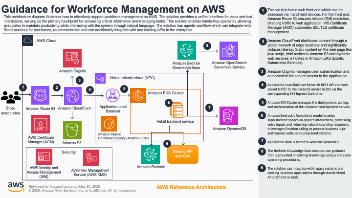
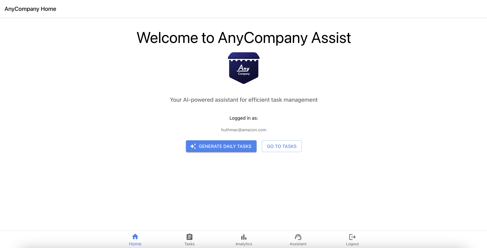
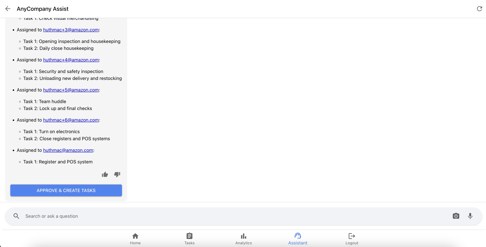
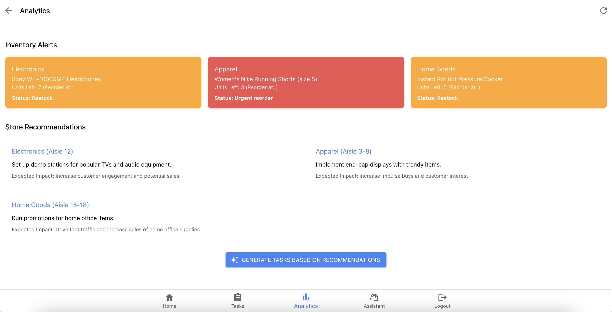
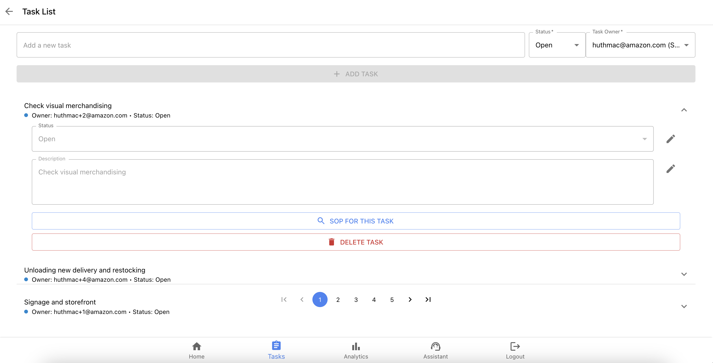
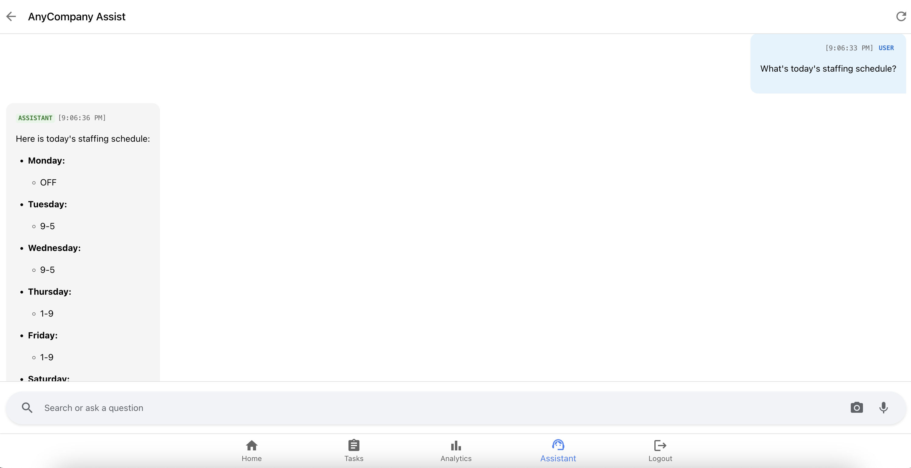

# Guidance for Workforce Management using Amazon Bedrock

## Table of Contents

1. [Overview](#overview)
    - [Cost](#cost)
2. [Prerequisites](#prerequisites)
    - [Operating System](#operating-system)
3. [Deployment Steps](#deployment-steps)
4. [Deployment Validation](#deployment-validation)
5. [Running the Guidance](#running-the-guidance)
6. [Next Steps](#next-steps)
7. [Cleanup](#cleanup)
8. [Disclaimer](#disclaimer)
9. [Authors](#authors)

## Overview

Retail organizations often struggle with challenges such as limited access to real-time information, inefficient operational processes due to siloed systems, and inconsistent customer service. Store associates typically have to navigate multiple applications to find relevant information, which hampers their ability to assist customers efficiently and follow standard operating procedures (SOPs).

Additionally, manual task management and communication barriers consume valuable manager time, leading to inconsistent task prioritization and inefficient schedule management. These issues result in reduced productivity, lower customer satisfaction, inconsistent store operations, higher training costs, and employee frustration. 

To address these problems, we built this Guidance to showcase AnyCompanyAssist, an AI-powered retail workforce solution that leverages Amazon Bedrock and speech-to-speech capabilities with Amazon Nova Sonic. This solution provides hands-free, natural language access to critical store information, task management, and customer insights, all through a single interface. By consolidating multiple applications and streamlining workflows, AnyCompanyAssist enables store managers to optimize operations and empowers associates to deliver enhanced customer service while maintaining operational efficiency.


### Architecture Overview

This guidance describes how to deploy the application on AWS using the AWS CDK. The application consists of:

1. A backend service hosted in Amazon EKS
2. A mobile web frontend hosted in Amazon S3 and accessed via Amazon CloudFront.

The application is deployed on AWS using the following services:

- **Amazon EKS**: For container orchestration without managing servers
- **Amazon ECR**: For storing Docker images
- **Application Load Balancer (ALB)**: For routing traffic to the services
- **Amazon Route53**: For DNS management (optional)
- **AWS Certificate Manager**: For SSL/TLS certificates
- **Amazon Cognito**: For user authentication
- **Amazon DynamoDB**: For data storage
- **Amazon S3 & CloudFront**: For hosting the web frontend
- **Amazon Bedrock & Amazon Bedrock Knowledge Bases**: LLM Gateway and RAG
- **Amazon OpenSearch**: Vector Store for standard operating procedure document




The architecture is organized into several logical stacks:

1. **Frontend Infrastructure**: Hosts the web application using S3 and CloudFront with Route 53 for DNS
2. **Authentication**: Manages user authentication and authorization using Cognito and IAM
3. **Container Infrastructure**: Runs the application backend service using EKS, and ECR
4. **Data Layer**: Stores and manages data using DynamoDB, OpenSearch, and Bedrock


### Cost

You are responsible for the cost of the AWS services used while running this Guidance. As of May 2025, the cost for running this Guidance with the default settings in the AWS Region US East 1 (N. Virginia) is approximately $<n.nn> per month for processing ( <nnnnn> records ).

We recommend creating a [Budget](https://docs.aws.amazon.com/cost-management/latest/userguide/budgets-managing-costs.html) through [AWS Cost Explorer](https://aws.amazon.com/aws-cost-management/aws-cost-explorer/) to help manage costs. Prices are subject to change. For full details, refer to the pricing webpage for each AWS service used in this Guidance.

### Sample Cost Table

The following table provides a sample cost breakdown for deploying this Guidance with the default parameters in the US East (N. Virginia) Region for one month.

| AWS Service | Dimensions | Cost [USD] |
|-------------|------------|---------------------|
| Amazon EKS | Number of hybrid nodes (per month), Number of EKS Clusters (1) | 73.00 |
| Amazon EC2 | Tenancy (Shared Instances), Operating system (Linux), Workload (Consistent, Number of instances: 2), Advance EC2 instance (t3.medium), Pricing strategy (On-Demand Utilization: 100% Utilized/Month), Enable monitoring (disabled), EBS Storage amount (20 GB), DT Inbound: Not selected (0 TB per month), DT Outbound: Not selected (0 TB per month), DT Intra-Region: (0 TB per month) | 63.94 |
| Amazon Simple Storage Service (S3) | S3 Standard storage (1 GB per month), PUT, COPY, POST, LIST requests to S3 Standard (100000), GET, SELECT, and all other requests from S3 Standard (100000), Data returned by S3 Select (1 GB per month), Data scanned by S3 Select (1 GB per month), DT Inbound: Not selected (0 TB per month), DT Outbound: Not selected (0 TB per month) | 0.57 |
| Amazon Elastic Container Registry | DT Inbound: Not selected (0 TB per month), DT Outbound: Not selected (0 TB per month), Amount of data stored (1 GB per month) | 0.10 |
| Elastic Load Balancing | Number of Application Load Balancers (1) | 16.44 |
| Amazon Cognito | Optimization Rate for Token Requests (0), Optimization Rate for App Clients (0), Advanced security features (Enabled), Number of monthly active users (MAU) (100), Number of token requests (1000) | 13.00 |
| Amazon DynamoDB | Table class (Standard), Average item size (all attributes) (1 KB), Data storage size (1 GB) | 0.25 |
| Amazon CloudFront | Data transfer out to internet (1 GB per month), Number of requests (HTTPS) (500000 per month), Data transfer out to origin (1 GB per month) | 0.61 |
| AWS Private Certificate Authority | Number of general purpose mode private certificates issued (1), Number of certificates used with ACM-integrated services (1) | 0.00 |
| Amazon Route 53 | Hosted Zones (1) | 0.90 |
| Amazon Bedrock | Number of Input tokens (10 million per month), Number of output tokens (1 million per month), Number of Input tokens (10 million per month) | 11.40 |
| Amazon OpenSearch Service | How many Indexing OCUs? (1), How many Search and Query OCUs? (1), How big is the index data? (1 GB) | 350.42 |


## Prerequisites

- Python 3.12+
- Node.js 18+
- AWS CLI configured with appropriate permissions
- Docker Desktop
- kubectl CLI
- The following Python libraries:
  * fastapi>=0.68.0
  * uvicorn>=0.15.0
  * starlette>=0.14.2
  * boto3==1.38.9
  * botocore==1.38.9
  * pydantic>=1.8.0
  * python-dotenv>=0.19.0
  * python-dateutil>=2.8.2
  * requests>=2.28.0
  * structlog>=21.1.0
  * aiohttp>=3.8.0
  * PyJWT>=2.8.0
  * cryptography>=41.0.0
  * pyaudio>=0.2.13
  * rx>=3.2.0
  * smithy-aws-core>=0.0.1
  * pytz
  * aws_sdk_bedrock_runtime==0.0.2
  * websockets==15.0.1
  * Pillow>=10.0.0
  * python-multipart


### Operating System

This sample code will deploy on Linux (Amazon Linux 2). To run locally, you will need to install and run Python on your local operating system, so Linux, Windows, and MacOS are acceptable.


### Third-party tools

This deployment requires a Docker environment in the environment from which you want to deploy the application from.


### AWS account requirements

This deployment requires you have public ACM certificate and DNS record available in your AWS account.


### aws cdk bootstrap

This Guidance uses the AWS CDK to deploy resources in an AWS Account.
If you are using AWS CDK for first time, please refer to this [documentation](https://docs.aws.amazon.com/cdk/v2/guide/bootstrapping-env.html) for inststructions on how to prepare your AWS account for AWS CDK.


### Supported Regions

Currently the speech-to-speech model Amazon Nova Sonic is only available in us-east-1. Therefore this guidance currently supports this region.


## Deployment Steps

### 1. Clone the repository:
   ```
   git clone <repository-url>
   cd guidance-for-workforce-management-using-amazon-bedrock
   ```

### 2. Configure Environment 

Go to the deployment directoy.

```bash
cd deployment
```

Then, create a `.env` file in the deployment directory with the following variable placeholders:

```

# This email will be used to create the initial store manager user in the system
EMAIL=your-email@example.com

PARENT_DOMAIN_NAME=XXX.dev
DOMAIN_NAME=retail.XXX.dev
# wildcard certificate for sub-domain e.g. *.retail.huthmac.people.amazon.dev for the backend
CERTIFICATE_ARN='XXX'
# certificate for domain e.g. retail.huthmac.people.amazon.dev
WEB_CERTIFICATE_ARN='XXX'

# AWS Configuration
AWS_REGION=us-east-1

# Stack Configuration
STACK_NAME=retail
STACK_ENVIRONMENT=dev

# Cognito details
COGNITO_USER_POOL_ID=us-east-1_XXXXXXXXX
COGNITO_APP_CLIENT_ID=1234567890abcdefghijklmnop

# Bedrock Configuration
BD_GUARDRAIL_IDENTIFIER=your-guardrail-id
BD_GUARDRAIL_VERSION=your-guardrail-version
BD_KB_ID=your-bedrock-kb-id
BEDROCK_MODEL_ID=us.amazon.nova-pro-v1:0

# storage for user uploads and website
S3_BUCKET_NAME=s3-data-storage-user-image-uploads
WEBSITE_BUCKET_NAME=website-storage

```

You can use the provided `.env.example` file as a template.


Update the EMAIL, PARENT_DOMAIN_NAME, DOMAIN_NAME, CERTIFICATE_ARN, WEB_CERTIFICATE_ARN with respective values for your environment, keep the other variables as placeholders as-is.

### 3. Run the Deployment Script

The deployment script will:
1. Deploy the CDK stack with EKS, ECR, and other resources.
2. Update the local .env file.
3. Build and push Docker image to ECR.
4. Configure kubectl to connect to the EKS cluster.
5. Build and deploy the frontend to S3.

```bash
cd deployment
chmod +x deploy.sh
./deploy.sh
```

### 4. Access the Application

After deployment, the script will output:
- Frontend URL
- CloudFront URL
- User Email
- Initial user password

Open the frontend url in a browser, and use the user email and initial user password to log into the application.


## Deployment Validation

### 1. Review Backend Logs

```bash
# View logs for the Retail API service
kubectl logs -n retail-app -l app=retailbackend
```

### 2. Checking Backend Service Status

```bash
kubectl get pods -n retail-app
kubectl get services -n retail-app
kubectl get ingress -n retail-app
```
Ensure that all services are in 'running' state.

### 3. End-to-End Test with Audio Inputs and Function Calling (Optional)

In the test directory there is a test harness and jupyter notebook to run through and end-to-end test.
The outputs are stored in the ./tests/responses directory.


## Running the Guidance

1. Access the web application in a browser through the URL/domain name that you have assigned.

* Home screen - Daily task assignments for retail staff: 
    * As store manager start creating new tasks assignments by clicking the "create daily tasks recommendation" button. 
    
    

    The LLM checks available staff and analyzes the tasks that have to be completed for the given day and creates a list of task assignments for the store manager to review. Once the store manager reviewed the tasks assignments, you can approve them. 
    
    

    Then the LLM goes through the list of recommended task assignments and creates the tasks for the respective users accordingly. This not only streamlines the work for the store manager, but also ensures that store associates work on the prioritized tasks accordingly.

* Analytics screen - Store Analytics: 
    * As store manager review the store KPIs and inventory levels. Based on this data, the LLM generates recommendations. Once the store manager reviewed the recommended actions, they can have the LLM create and assign tasks to the available staff accordingly.

    

* Tasks screen - Questions & answers grounded in SOP of the store:
    * As store associate get an overview of your assigned tasks. Click on a task to get further details or mark the task as complete. In addition, new store associates can click on the "SOP search" button for any given task to get even more detailed instructions that are grounded in the standard operating procedures of the store. This is enabled through a RAG system that takes the task details as input and searches the SOP document to provide additional guidance. Further, this solution enables store associates to ask any question via text or voice, and get answers that are grounded in the SOP of the store.

    

* Assistant screen - Personalized customer interactions: 
    * Store associates can lookup product or customer information either via text or speech, which not only enables store associates to provide personalized product recommendations to customers, but also simplifies how store associates can leverage the information that is typically stored in dozens of siloed applications.
    * Store associates can also lookup their schedule and time-off balance. In addition they can submit time-off requests without having to switch between multiple applications.

    


## Next Steps
Some ideas to experiment with:
 - Replace LLM instructions with details related to your requirements.
 - Replace product,schedule information in DynamoDB with the relevant information for your business.
 - Replace SOP document used by the knowledge base with your standard operating procedures.


## Cleanup

To delete all resources created by this stack:

```bash
cd deployment
chmod +x destroy.sh
./destroy.sh
```

Note: This will delete all resources including the EKS cluster, ECR repositories, and DynamoDB tables.


## Disclaimer

Customers are responsible for making their own independent assessment of the information in this Guidance. This Guidance: (a) is for informational purposes only, (b) represents AWS current product offerings and practices, which are subject to change without notice, and (c) does not create any commitments or assurances from AWS and its affiliates, suppliers or licensors. AWS products or services are provided "as is" without warranties, representations, or conditions of any kind, whether express or implied. AWS responsibilities and liabilities to its customers are controlled by AWS agreements, and this Guidance is not part of, nor does it modify, any agreement between AWS and its customers.


## Authors

- Felix Huthmacher, Senior Applied AI Architect [github - fhuthmacher](https://github.com/fhuthmacher)
